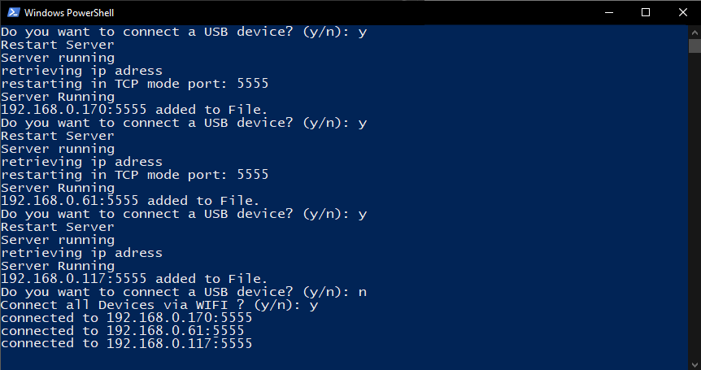
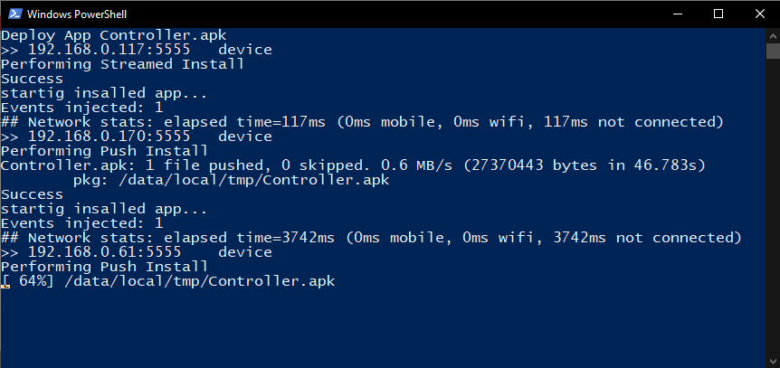

# Deploy-Android-App 

Simplify the process of deploying apps to your android devices. 

Implementation for unity is coming soon.

## Setup

You'll need a adb driver and one or more android devices, working wifi or usb cabel.

Download the adb driver [here](https://dl.google.com/android/repository/platform-tools_r30.0.1-windows.zip) , entpack the zip and place the files e.g. under c:/ADB/ .

Add this folder to the your system variables.
 - press windows button
 - type in search field "path"
 - click on "Edit System Variables"
 - add the folder path to the Path variable

If everything is setup correctly, just open any command line tool and enter adb.
It should print a wall of text, this means adb driver is working.

### How to Deploy
- download the 2 x .ps1 files and packageName.txt
- put them in the same folder where your apk is
- open packageName.txt type in the package name e.g (com.CompanyName.ProductName)
#### USB
- execute DeployAppToAllDevices.ps1
- it loads and installs the apk in the same folder to all connected devices
#### WIFI

- do once ur pc started
  - connect the first device via usb
  - run SetupDevices.ps1 it ask if you want to setup the device press y  
  - once it is done it will ask again, connect the next device and press y  
  - do this with all devices  
  - if you are done and it asks again press n  
  - now it asks if it should connect all devices press again y  
  - now all devices are listening and you can delpoy new apks easily over wifi to all devices
 - execute DeployAppToAllDevices.ps1
 -  it loads and installs the apk in the same folder to all connected devices and starts the app
 
 
 

